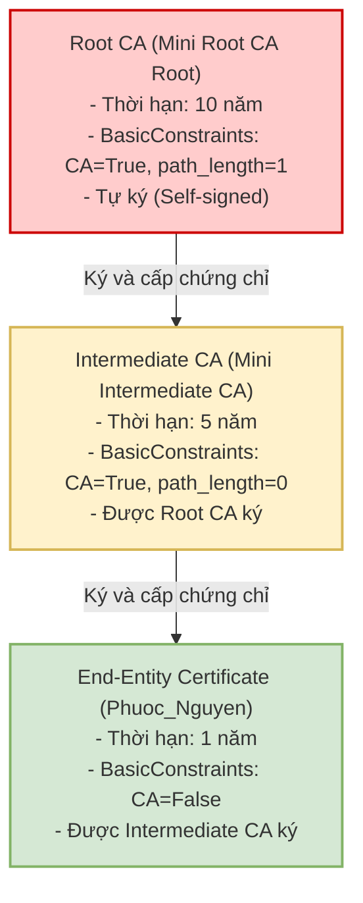
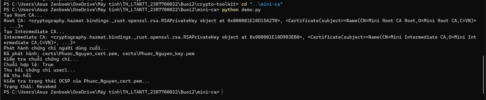
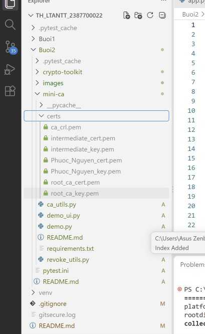
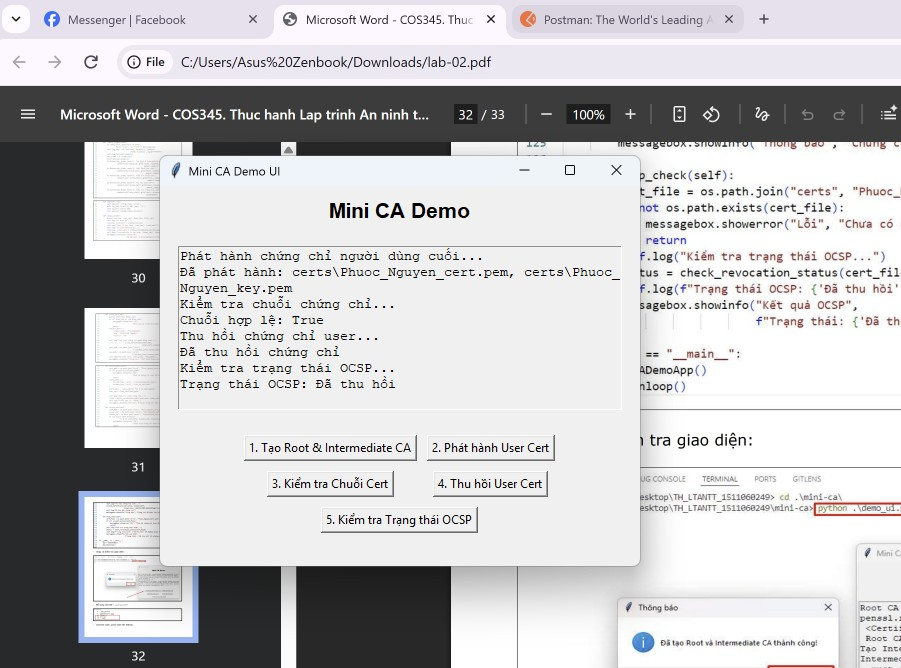

### Họ và Tên: Phạm Gia Huy_2387700022

## BÁO CÁO KỸ THUẬT: MINI-CA (PKI & X.509)
### THIẾT KẾ HẠ TẦNG KHÓA CÔNG KHAI, VÒNG ĐỜI CHỨNG CHỈ & CƠ CHẾ THU HỒI CRL/OCSP

---

## 1. Giới thiệu và Kiến trúc Hạ tầng PKI

Phân hệ `mini-ca` mô phỏng một hệ thống Hạ tầng Khóa Công khai (Public Key Infrastructure - PKI) hoàn chỉnh theo tiêu chuẩn quốc tế **ITU-T X.509 v3 / RFC 5280**, cho phép quản lý toàn bộ vòng đời của chứng chỉ số từ khởi tạo, phát hành, xác thực chuỗi đến thu hồi:

```text
mini-ca/
├── certs/
│   ├── root_ca_key.pem
│   ├── root_ca_cert.pem
│   ├── intermediate_key.pem
│   ├── intermediate_cert.pem
│   ├── Phuoc_Nguyen_key.pem
│   ├── Phuoc_Nguyen_cert.pem
│   └── ca_crl.pem
├── ca_utils.py
├── revoke_utils.py
├── demo.py
├── demo_ui.py
├── requirements.txt
└── README.md
```

---

## 2. Kiến trúc phân cấp và Chuỗi tin cậy (Chain of Trust)

Mô hình triển khai phân cấp 2 tầng được thiết kế nhằm bảo vệ khóa gốc và phân định quyền hạn rõ ràng:



---

## 3. Phân tích chi tiết các Module mã nguồn

### 3.1. Module `ca_utils.py` — Khởi tạo và Quản lý Chứng chỉ số

#### a. Root CA (`create_root_ca`):
* **Cơ chế tự ký (Self-signed):** Subject và Issuer hoàn toàn trùng khớp nhau (`subject = issuer`).
* **BasicConstraints:** Thiết lập `ca=True` và `path_length=1`. Thuộc tính `path_length=1` mang ý nghĩa bảo mật tối quan trọng: Root CA chỉ cho phép tồn tại tối đa đúng 1 cấp CA trung gian bên dưới nó, ngăn ngừa việc tùy tiện tạo ra các chuỗi CA sâu không thể kiểm soát.
* **Thời hạn hiệu lực:** 10 năm (3,650 ngày), phản ánh đặc tính của các Root CA thương mại ngoài thực tế vốn có vòng đời dài để cài sẵn vào trust store của hệ điều hành.

#### b. Intermediate CA (`create_intermediate_ca`):
* **Issuer:** Được trỏ về Subject của Root CA và được ký trực tiếp bởi khóa bí mật của Root CA.
* **BasicConstraints:** Thiết lập `ca=True` nhưng `path_length=0`. Điều này quy định Intermediate CA chỉ được phép phát hành chứng chỉ cho người dùng cuối (End-entity), tuyệt đối không được phép cấp tiếp CA con khác.

#### c. End-Entity Certificate (`issue_certificate`):
* **BasicConstraints:** `ca=False`, xác định rõ đây là chứng chỉ người dùng hoặc máy chủ, không có quyền phát hành chứng chỉ khác.
* **Thời hạn hiệu lực:** 1 năm (365 ngày), tuân thủ tiêu chuẩn rút ngắn tuổi thọ chứng chỉ của CA/Browser Forum nhằm giảm thiểu rủi ro khi bị rò rỉ khóa bí mật.

#### d. Thẩm định chuỗi tin cậy (`verify_certificate_chain`):
Hàm duyệt ngược qua danh sách các chứng chỉ trong chuỗi `[Intermediate CA, Root CA]`:
* Lấy Public Key của tổ chức phát hành (`issuer_cert.public_key()`).
* Gọi phương thức thẩm định chữ ký toán học:
  $$\text{Verify}\big(\text{Signature},\; \text{TBS\_Bytes},\; \text{PKCS1v15},\; \text{SHA256}\big)$$
* Nếu chữ ký số hợp lệ và chuỗi toàn vẹn từ lá tới gốc, hàm trả về `True`.

---

### 3.2. Module `revoke_utils.py` — Quản lý Danh sách thu hồi (CRL) & OCSP

* **Tạo và cập nhật CRL (`revoke_certificate`):**  
  Khi chứng chỉ bị lộ khóa hoặc người dùng rời tổ chức, hàm sẽ khởi tạo đối tượng `RevokedCertificateBuilder` ghi nhận số định danh `serial_number`, thời điểm thu hồi và lý do (`ReasonFlags.key_compromise`), sau đó ký số danh sách này bằng khóa của CA.
* **Mô phỏng kiểm tra trực tuyến OCSP (`check_revocation_status`):**  
  Hàm trích xuất `serial_number` từ chứng chỉ đang cần kiểm tra và đối chiếu trực tiếp với các bản ghi trong tệp `ca_crl.pem`. Nếu tìm thấy số serial trùng khớp, hàm xác định trạng thái chứng chỉ đã bị thu hồi (`Revoked`).

---

## 4. Các phương thức kiểm thử và thực nghiệm

### 4.1. Kịch bản chạy tự động Console (`demo.py`)
Lệnh thực thi:
```bash
cd Buoi2/mini-ca
python demo.py
```
Quá trình chạy tự động thực hiện tuần tự:
1. Tạo cặp khóa và chứng chỉ tự ký Root CA.
2. Tạo cặp khóa và chứng chỉ Intermediate CA do Root ký.
3. Cấp phát chứng chỉ người dùng cuối `Phuoc_Nguyen`.
4. Thẩm định chuỗi tin cậy 2 tầng thành công (`Chuỗi hợp lệ: True`).
5. Đưa chứng chỉ `Phuoc_Nguyen` vào danh sách thu hồi CRL với lý do `key_compromise`.
6. Kiểm tra trạng thái OCSP ghi nhận `Trạng thái: Revoked`.



---

### 4.2. Kiểm tra thư mục chứng chỉ `certs/`
Sau khi chạy script, kiểm tra thư mục `certs/` ghi nhận đủ 7 tệp tin:



---

### 4.3. Ứng dụng Desktop tương tác trực quan (`demo_ui.py`)
Lệnh thực thi:
```bash
python demo_ui.py
```
Ứng dụng Tkinter trực quan hóa 5 bước của vòng đời chứng chỉ:
* Nút **1. Tạo Root & Intermediate CA**
* Nút **2. Phát hành User Cert**
* Nút **3. Kiểm tra Chuỗi Cert**
* Nút **4. Thu hồi User Cert**
* Nút **5. Kiểm tra Trạng thái OCSP**



---

## 5. Phân tích bảo mật & Thực tiễn triển khai PKI

1. **Ý nghĩa sống còn của Intermediate CA:**  
   Nếu chỉ dùng Root CA để trực tiếp ký cấp phát chứng chỉ cho hàng ngàn máy chủ hoặc nhân viên, khi có bất kỳ sự cố rò rỉ nào, khóa bí mật của Root CA sẽ bị lộ. Việc thay thế Root CA là một thảm họa vì nó đòi hỏi phải cập nhật firmware, hệ điều hành và trình duyệt trên toàn cầu. Mô hình sử dụng Intermediate CA cho phép cất giữ khóa Root CA hoàn toàn offline trong két sắt an toàn (air-gapped HSM), chỉ bật lên khi cần cấp mới Intermediate CA.
2. **So sánh cơ chế thu hồi CRL vs. OCSP Stapling:**  
   * **CRL (Certificate Revocation List):** Trình duyệt phải tải toàn bộ danh sách các chứng chỉ bị thu hồi về máy. Khi hệ thống lớn, dung lượng CRL có thể lên tới hàng chục Megabytes, gây chậm trễ nghiêm trọng và tốn băng thông.
   * **OCSP (Online Certificate Status Protocol):** Trình duyệt gửi truy vấn kiểm tra riêng cho một số serial cụ thể. Tuy nhiên, việc này lại làm lộ lịch sử duyệt web của người dùng cho CA (vấn đề Privacy).
   * **OCSP Stapling (Giải pháp tối ưu hiện đại):** Máy chủ Web định kỳ tự lấy phản hồi OCSP có chữ ký số của CA và gửi "kèm" (staple) trong quá trình bắt tay TLS với trình duyệt, vừa đảm bảo tốc độ tối đa vừa bảo vệ quyền riêng tư người dùng.
