### Họ và Tên: Phạm Gia Huy_2387700022

## BÀI 3: BẢO MẬT MẠNG MÁY TÍNH
### BÁO CÁO THỰC HÀNH: LẬP TRÌNH SOCKET AN TOÀN (SECURECHAT) & BỘ CÔNG CỤ TRINH SÁT MẠNG (NETRECON)

---

## 1. Giới thiệu tổng quan

Bài thực hành số 3 trang bị kiến thức chuyên sâu và kỹ năng thực hành về an toàn mạng máy tính ở tầng giao vận và ứng dụng, bao gồm hai hợp phần trọng tâm:

1. **SecureChat (`Buoi3/secure-chat`):** Xây dựng ứng dụng phòng chat bảo mật đa luồng sử dụng socket an toàn qua giao thức **SSL/TLS**. Hệ thống triển khai cơ chế xác thực chứng chỉ số hai chiều (**Mutual TLS / mTLS**), mã hóa đối xứng đầu-cuối (**AES-256-CBC with PKCS#7 padding**), quản lý phiên kết nối đa người dùng (**ConnectionManager**) và phân chia phòng chat độc lập (**RoomManager**).
2. **NetRecon (`Buoi3/netrecon`):** Xây dựng bộ công cụ trinh sát mạng và thu thập thông tin mục tiêu (**Network Reconnaissance & Vulnerability Assessment**) hoạt động dưới cả hai môi trường: giao diện dòng lệnh (**CLI**) và ứng dụng web trực quan (**Flask + HTMX**). Công cụ tích hợp quét cổng bất đồng bộ đa luồng (**Asyncio Port Scanner**), nhận diện dịch vụ và phiên bản ứng dụng (**Nmap Service Fingerprinting**), thu thập thông tin chào hỏi (**Banner Grabbing**), khảo sát sơ đồ mạng cục bộ qua ARP table (**Network Mapper**), rà soát cổng dịch vụ dính lỗ hổng đã biết (**CVE Vulnerability Checker**) và gửi báo cáo kết quả tự động qua **Gmail SMTP (SSL)**.

---

## 2. Cấu trúc thư mục Buổi 3

```text
Buoi3/
├── secure-chat/
│   ├── certs/
│   │   ├── ca/
│   │   │   ├── ca.crt
│   │   │   ├── ca.key
│   │   │   └── ca.srl.bak
│   │   ├── client/
│   │   │   ├── client.crt
│   │   │   ├── client.csr
│   │   │   └── client.key
│   │   └── server/
│   │       ├── server.crt
│   │       ├── server.csr
│   │       └── server.key
│   ├── openssl.cnf
│   ├── make-certs.bat
│   ├── message_encryption.py
│   ├── connection_manager.py
│   ├── room_manager.py
│   ├── server.py
│   └── client.py
├── netrecon/
│   ├── modules/
│   │   ├── __init__.py
│   │   ├── banner_grabber.py
│   │   ├── email_sender.py
│   │   ├── filter_utils.py
│   │   ├── network_mapper.py
│   │   ├── port_scanner.py
│   │   ├── service_detector.py
│   │   └── vuln_checker.py
│   ├── static/
│   │   └── style.css
│   ├── templates/
│   │   ├── index.html
│   │   ├── layout.html
│   │   └── result.html
│   ├── requirements.txt
│   ├── cli.py
│   ├── app.py
│   ├── netrecon.log
│   └── .env (được bảo vệ trong .gitignore)
├── ảnh/
└── README.md
```

---

## 3. Bảng tổng hợp công nghệ & Cơ chế an toàn

| Hợp phần | Thành phần kỹ thuật | Tiêu chuẩn / Công nghệ | Thư viện & Công cụ | Đặc tính bảo mật cốt lõi |
|---|---|---|---|---|
| **SecureChat** | Kênh truyền an toàn | **SSL/TLS 1.2+** | Module `ssl` Python | Bắt tay mã hóa đường truyền, chống tấn công nghe lén (Eavesdropping) và tấn công xen giữa (MITM). |
| **SecureChat** | Xác thực chứng chỉ | **Mutual TLS (mTLS)** | `OpenSSL` (X.509 v3) | Xác thực danh tính 2 chiều: Server xác thực Client (`CERT_REQUIRED`) và Client thẩm định Server qua Root CA. |
| **SecureChat** | Mã hóa đầu-cuối | **AES-256-CBC + PKCS#7** | `cryptography.hazmat` | Khóa phiên AES 256-bit sinh ngẫu nhiên mỗi phiên, IV 16-byte ngẫu nhiên chống phân tích thống kê mã hóa. |
| **SecureChat** | Quản lý phiên đa luồng | **Thread-safe Lock** | `threading` | Khóa `threading.Lock()` bảo vệ danh sách phiên kết nối và dữ liệu phát thanh phân vùng an toàn. |
| **NetRecon** | Quét cổng bất đồng bộ | **TCP Connect Scan** | `asyncio`, `socket` | Sử dụng `asyncio.Semaphore` kiểm soát lưu lượng quét, chống nghẽn đường truyền và tránh kích hoạt IDS/IPS. |
| **NetRecon** | Nhận diện dịch vụ | **Service Fingerprinting** | `Nmap (-sV)` | Phân tích sâu giao thức tầng ứng dụng nhằm xác định chính xác phần mềm và số hiệu phiên bản. |
| **NetRecon** | Bắt biểu ngữ mạng | **Active Banner Grabbing** | `socket (recv)` | Gửi truy vấn và bóc tách chuỗi phản hồi chào mừng mặc định của daemon dịch vụ. |
| **NetRecon** | Ánh xạ cấu trúc mạng | **ARP Cache Inspection** | Hệ điều hành `arp -a` | Đọc bảng định tuyến MAC-IP cục bộ nhanh chóng, không phát sinh gói tin thăm dò bất thường. |
| **NetRecon** | Rà soát lỗ hổng | **Vulnerability Mapping** | Cơ sở dữ liệu CVE | Đối soát cổng dịch vụ tiêu chuẩn với danh mục lỗ hổng bảo mật nghiêm trọng (RCE, Auth Bypass). |
| **NetRecon** | Báo cáo bảo mật | **SMTP qua TLS/SSL (Port 465)** | `smtplib`, `email.message` | Mã hóa thông tin kết quả quét trước khi đẩy qua hệ thống máy chủ thư Gmail. |

---

## 4. Hướng dẫn thiết lập & Chạy ứng dụng

### 4.1. Cài đặt thư viện môi trường
Trong thư mục gốc dự án hoặc môi trường ảo `venv`:
```powershell
pip install -r Buoi3/netrecon/requirements.txt
```

### 4.2. Cài đặt OpenSSL & Nmap
* **OpenSSL:** Hệ thống đã tích hợp sẵn OpenSSL từ Git (`C:\Program Files\Git\usr\bin\openssl.exe`) hoặc bản cài đặt Win64 OpenSSL. Script `make-certs.bat` được thiết kế tự động dò tìm đường dẫn thực thi.
* **Nmap:** Tải bộ cài `nmap-7.97-setup.exe` từ trang chủ `https://nmap.org/download.html` (đã được tải sẵn về thư mục `Downloads`) và tiến hành cài đặt chuẩn.

---

## 5. Hướng dẫn từng bước thực hành & Chụp ảnh minh chứng

Dưới đây là 15 bước thực hành tương ứng với 15 hình ảnh minh chứng cần lưu vào thư mục `Buoi3/ảnh/` để hoàn tất báo cáo:

### HỢP PHẦN 1: BẢO MẬT SOCKET (SECURECHAT)

#### Bước 1: Kiểm tra OpenSSL trên máy tính
* **Thao tác:** Mở Terminal và gõ:
  ```powershell
  openssl help
  ```
* **Chụp ảnh:** Màn hình Terminal hiển thị danh sách các lệnh của OpenSSL (`Standard commands`, `Cipher commands`).
* **Lưu file:** `Buoi3/ảnh/01_openssl_path_check.jpg`

#### Bước 2: Tạo bộ chứng chỉ số bằng `make-certs.bat`
* **Thao tác:** Mở Terminal, di chuyển vào thư mục `Buoi3/secure-chat` và thực thi:
  ```powershell
  cd Buoi3\secure-chat
  .\make-certs.bat
  ```
* **Chụp ảnh:** Màn hình Terminal thông báo quá trình sinh khóa bí mật và chứng chỉ số x509 thành công (`Certificate request self-signature ok`, `Cac chung chi da tao xong!`).
* **Lưu file:** `Buoi3/ảnh/02_make_certs_batch.jpg`

#### Bước 3: Kiểm tra cấu trúc chứng chỉ trong thư mục `certs/`
* **Thao tác:** Mở trình duyệt cây thư mục trên VS Code hoặc File Explorer tại `Buoi3/secure-chat/certs`.
* **Chụp ảnh:** Cây thư mục hiển thị 3 thư mục con `ca/`, `client/`, `server/` cùng các file chứng chỉ `.crt`, khóa bí mật `.key`.
* **Lưu file:** `Buoi3/ảnh/03_certs_tree_structure.jpg`

#### Bước 4: Khởi động Server và kết nối 1 Client
* **Thao tác:** 
  * Terminal 1: Chạy Server:
    ```powershell
    python server.py
    ```
  * Terminal 2: Chạy Client thứ nhất:
    ```powershell
    python client.py
    ```
    Nhập tên người dùng (ví dụ: `huy`) và gõ tin nhắn chào: `xin chao`.
* **Chụp ảnh:** Màn hình chia đôi Terminal hiển thị Server ghi nhận kết nối Client và nhận được tin nhắn đã giải mã.
* **Lưu file:** `Buoi3/ảnh/04_secure_chat_1client.jpg`

#### Bước 5: Kiểm tra giao tiếp giữa nhiều Client (Multi-client Chat)
* **Thao tác:** Mở thêm Terminal thứ 3, khởi động Client thứ hai (ví dụ: `lan`):
  ```powershell
  python client.py
  ```
  Nhắn tin qua lại giữa hai client để kiểm tra tính năng mã hóa và phát tán tin nhắn phòng họp.
* **Chụp ảnh:** Màn hình hiển thị cả 3 Terminal (1 Server và 2 Client) chat qua lại thành công.
* **Lưu file:** `Buoi3/ảnh/05_secure_chat_2clients.jpg`

#### Bước 6: Commit phần SecureChat lên Git
* **Thao tác:** Chạy lệnh commit:
  ```powershell
  git add .
  git commit -m "[add] secure chat"
  git push origin main
  ```
* **Chụp ảnh:** Màn hình Terminal hiển thị kết quả commit thành công các file của `secure-chat`.
* **Lưu file:** `Buoi3/ảnh/06_git_commit_secure_chat.jpg`

---

### HỢP PHẦN 2: CÔNG CỤ TRINH SÁT MẠNG (NETRECON)

#### Bước 7: Kiểm tra cài đặt Nmap
* **Thao tác:** Mở Terminal và chạy lệnh:
  ```powershell
  nmap -v
  ```
* **Chụp ảnh:** Màn hình hiển thị phiên bản Nmap và bản quyền bảo mật.
* **Lưu file:** `Buoi3/ảnh/07_nmap_install_check.jpg`

#### Bước 8: Thiết lập Mật khẩu ứng dụng Gmail (App Password)
* **Thao tác:** Truy cập `https://myaccount.google.com/apppasswords`, tạo App Password tên `Netrecon` và lưu vào file `Buoi3/netrecon/.env`:
  ```env
  SMTP_USER=email_cua_ban@gmail.com
  SMTP_PASS=mat_khau_ung_dung_16_chu
  ```
* **Chụp ảnh:** Trang web Google hiển thị đã tạo thành công Mật khẩu ứng dụng.
* **Lưu file:** `Buoi3/ảnh/08_gmail_app_password.jpg`

#### Bước 9: Kiểm tra CLI NetRecon ở chế độ toàn diện
* **Thao tác:** Di chuyển vào thư mục `Buoi3/netrecon` và chạy:
  ```powershell
  cd Buoi3\netrecon
  python cli.py
  ```
  Nhập Target IP (ví dụ: IP máy của bạn hoặc router `192.168.1.1`).
* **Chụp ảnh:** Màn hình Terminal hiển thị kết quả trinh sát đầy đủ (Service Detection, Banner, ARP Map).
* **Lưu file:** `Buoi3/ảnh/09_netrecon_cli_default.jpg`

#### Bước 10: Chạy các bài test nhanh qua CLI
* **Thao tác:** Chạy lần lượt các lệnh:
  ```powershell
  python cli.py --target scanme.nmap.org --ports 22,80 --mode scan
  python cli.py --target 192.168.1.1 --ports 21,22,80,443 --mode all
  ```
* **Chụp ảnh:** Terminal hiển thị kết quả mở cổng TCP (`[+] 80/tcp open`, `[+] 22/tcp open`) và phân tích lỗ hổng.
* **Lưu file:** `Buoi3/ảnh/10_netrecon_cli_fast_test.jpg`

#### Bước 11: Khởi động máy chủ Web NetRecon
* **Thao tác:** Chạy ứng dụng web Flask:
  ```powershell
  python app.py
  ```
* **Chụp ảnh:** Terminal thông báo máy chủ Flask đang phục vụ tại `http://127.0.0.1:5000/`.
* **Lưu file:** `Buoi3/ảnh/11_netrecon_web_server.jpg`

#### Bước 12: Nhập thông tin khảo sát trên giao diện Web
* **Thao tác:** Mở trình duyệt web truy cập `http://localhost:5000/`, điền Target IP, Ports `22,80,443`, chọn Mode `All`, nhập Email nhận kết quả và bấm nút `Scan`.
* **Chụp ảnh:** Giao diện Form Web NetRecon trước khi gửi request.
* **Lưu file:** `Buoi3/ảnh/12_netrecon_web_form.jpg`

#### Bước 13: Kết quả phân tích hiển thị trên Web
* **Thao tác:** Xem kết quả trinh sát mạng hiển thị ngay trên trang nhờ công nghệ AJAX của HTMX.
* **Chụp ảnh:** Khối kết quả phân tích Service Detection, Banner Grabbing, Network Map trên giao diện web.
* **Lưu file:** `Buoi3/ảnh/13_netrecon_web_result.jpg`

#### Bước 14: Kiểm tra Email nhận kết quả tự động
* **Thao tác:** Mở hộp thư đến Gmail được chỉ định trong form quét mạng.
* **Chụp ảnh:** Email thông báo tiêu đề `"Kết quả quét từ NetRecon"` kèm nội dung báo cáo chi tiết.
* **Lưu file:** `Buoi3/ảnh/14_email_notification.jpg`

#### Bước 15: Commit toàn bộ dự án NetRecon lên GitHub
* **Thao tác:** Thực hiện commit và push:
  ```powershell
  git add .
  git commit -m "[add] netrecon"
  git push origin main
  ```
* **Chụp ảnh:** Terminal hiển thị trạng thái commit và push thành công lên remote GitHub repository.
* **Lưu file:** `Buoi3/ảnh/15_git_commit_netrecon.jpg`

---

## 6. Danh mục hình ảnh thực nghiệm thực tế (Output Screenshots)

Dưới đây là toàn bộ hình ảnh minh chứng thực tế được thực hiện trực tiếp trên hệ thống:

### 1. Sinh chứng chỉ số tự động (`make-certs.bat`)
* **Mô tả:** Chạy file kịch bản tạo chứng chỉ gốc Root CA, Server và Client thành công với OpenSSL.
* **Đường dẫn:** `ảnh/02_make_certs_batch.jpg`

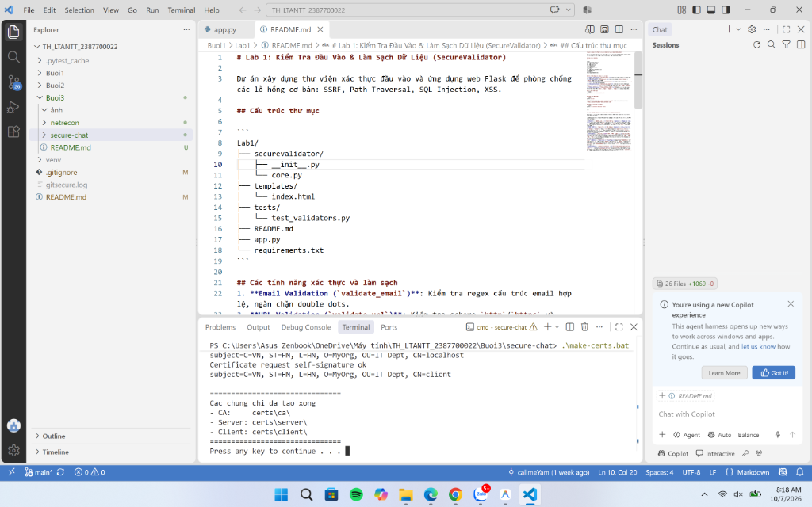

---

### 2. Cấu trúc tệp tin chứng chỉ trong thư mục `certs/`
* **Mô tả:** Cây thư mục VS Code hiển thị đầy đủ các thư mục phân cấp `ca/`, `client/`, `server/` chứa khóa bí mật và chứng chỉ X.509.
* **Đường dẫn:** `ảnh/03_certs_tree_structure.jpg`

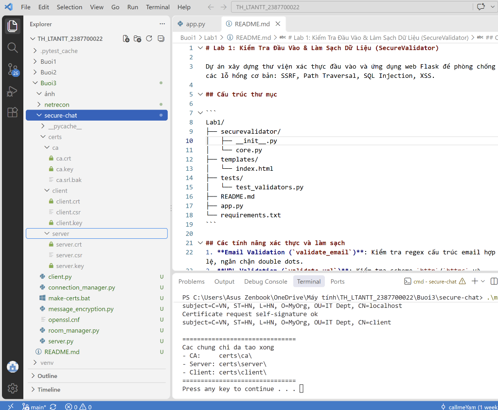

---

### 3. Khởi động SecureChat Server và kết nối 1 Client
* **Mô tả:** Server socket TLS khởi động trên port 8443, Client xác thực chứng chỉ và bắt tay gửi tin nhắn chào mừng.
* **Đường dẫn:** `ảnh/04_secure_chat_1client.jpg`

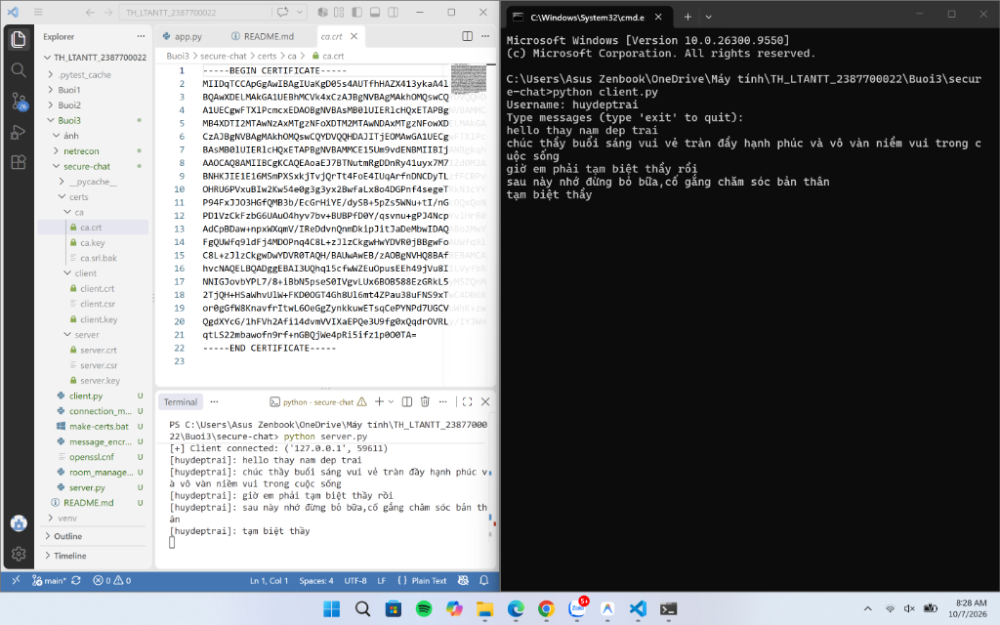

---

### 4. Kiểm nghiệm phòng chat bảo mật đa Client (mTLS & E2EE)
* **Mô tả:** Mô hình 3 cửa sổ (1 Server và 2 Client) trao đổi dữ liệu mã hóa 2 chiều qua phòng chat `general`.
* **Đường dẫn:** `ảnh/05_secure_chat_2clients.jpg`

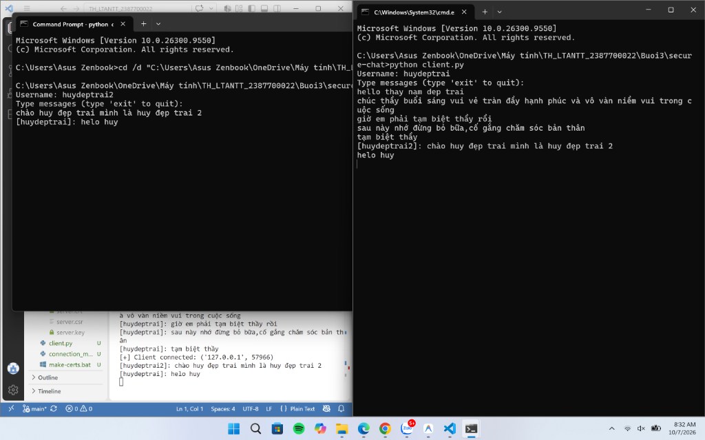

---

### 5. Kiểm tra công cụ Nmap trên hệ thống
* **Mô tả:** Lệnh `nmap -v` xác nhận Nmap phiên bản 7.97 đã sẵn sàng phục vụ tính năng quét dịch vụ.
* **Đường dẫn:** `ảnh/07_nmap_install_check.jpg`

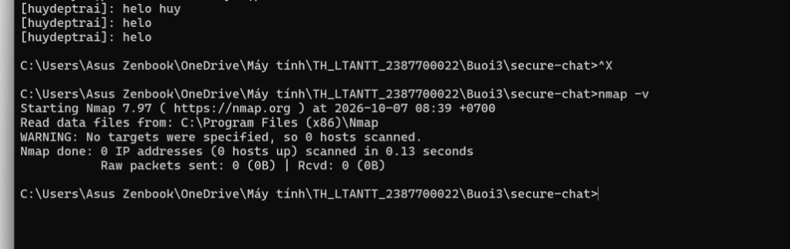

---

### 6. Cấu hình Mật khẩu ứng dụng Google (App Password)
* **Mô tả:** Tạo App Password `Netrecon` trên Google Account để cấp quyền gửi email báo cáo an toàn qua cổng SMTP 465.
* **Đường dẫn:** `ảnh/08_gmail_app_password.jpg`

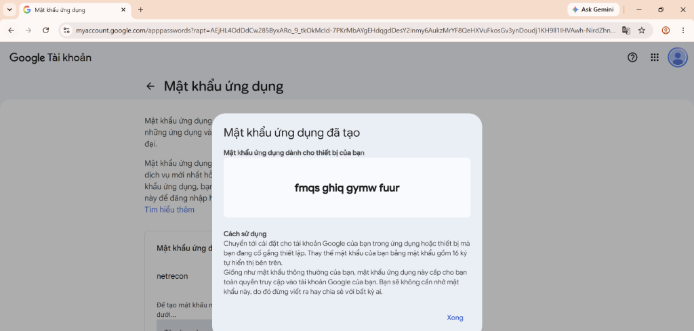

---

### 7. Khảo sát mạng toàn diện qua giao diện dòng lệnh NetRecon CLI
* **Mô tả:** Giao diện dòng lệnh Click phân tích chi tiết Service Detection, Banner Grabbing, ARP Map và CVE Mapping.
* **Đường dẫn:** `ảnh/09_netrecon_cli_default.jpg`

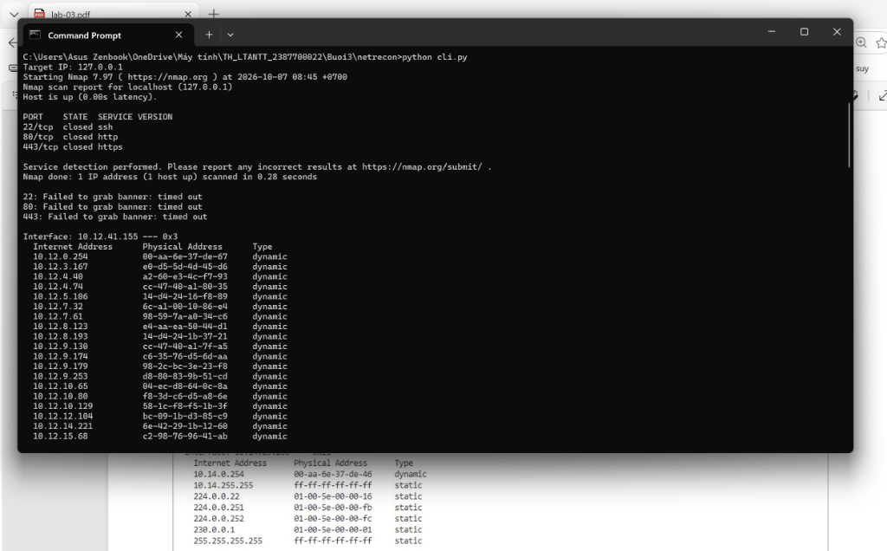

---

### 8. Test nhanh các tính năng Port Scan và Mode Vuln trên CLI
* **Mô tả:** Kiểm tra quét nhanh cổng bất đồng bộ trên máy chủ `scanme.nmap.org` và đối soát từ điển lỗ hổng.
* **Đường dẫn:** `ảnh/10_netrecon_cli_fast_test.jpg`

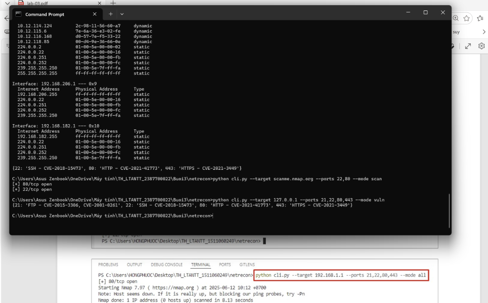

---

### 9. Khởi động Web Server Flask
* **Mô tả:** Máy chủ web backend khởi chạy phục vụ giao diện điều khiển tại `http://127.0.0.1:5000/`.
* **Đường dẫn:** `ảnh/11_netrecon_web_server.jpg`


---

### 10. Giao diện người dùng Web NetRecon Toolkit
* **Mô tả:** Form khảo sát mạng trực quan cho phép nhập IP mục tiêu, dải cổng, chọn chế độ trinh sát và email nhận tin.
* **Đường dẫn:** `ảnh/12_netrecon_web_form.jpg`

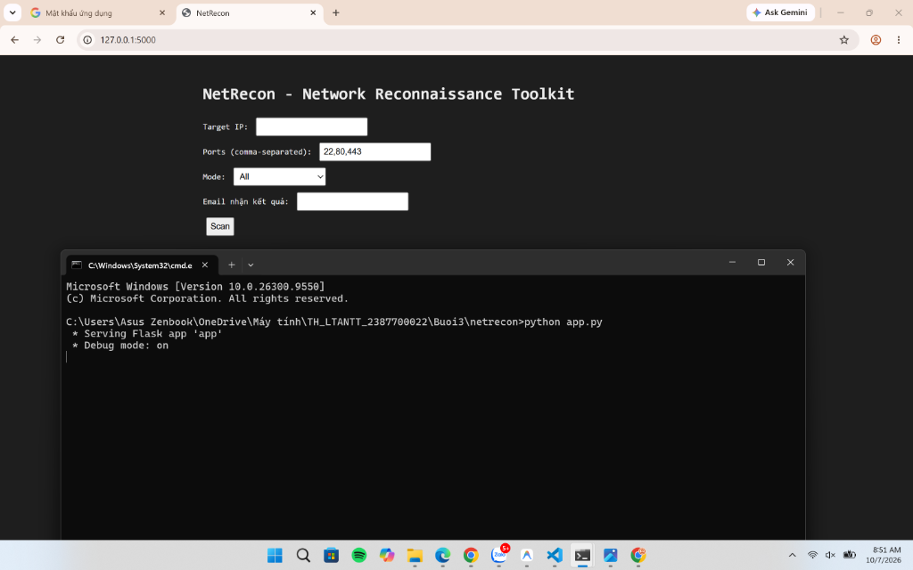

---

### 11. Kết quả phản hồi trinh sát mạng trên Web Dashboard
* **Mô tả:** Kết quả phân tích chi tiết hiển thị tức thì trên giao diện nhờ kỹ thuật cập nhật DOM động của HTMX.
* **Đường dẫn:** `ảnh/13_netrecon_web_result.jpg`

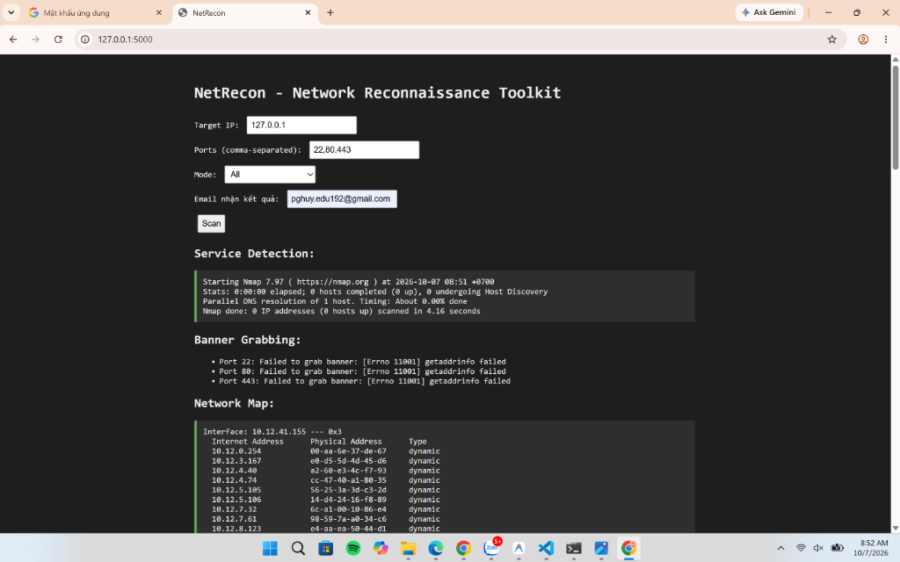

---

### 12. Email thông báo kết quả trinh sát gửi tự động qua SMTP SSL
* **Mô tả:** Hộp thư đến Gmail nhận báo cáo đầy đủ từ hệ thống NetRecon với định dạng cấu trúc bảo mật.
* **Đường dẫn:** `ảnh/14_email_notification.jpg`

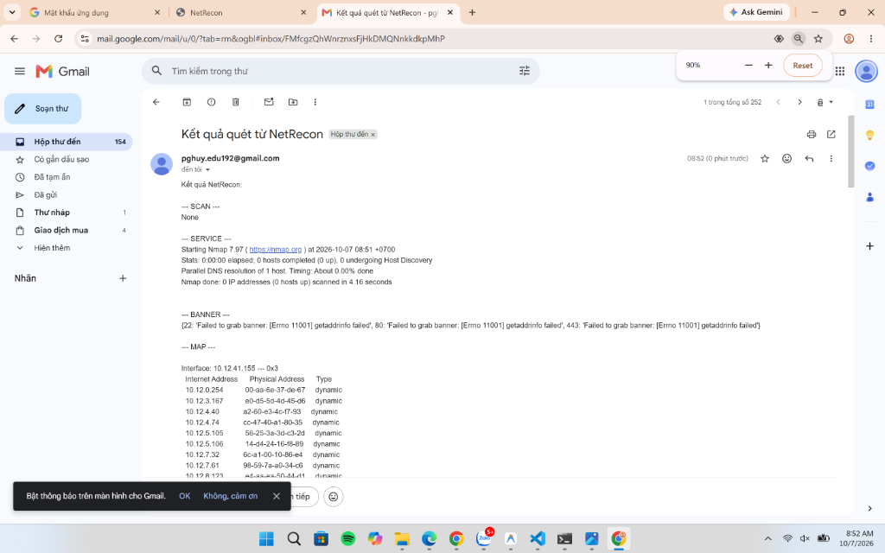
